# VChat TRUN: Bypassing DEP with ROP Intro

*Notice*: The following exploit, and its procedures are based on the original [Blog](https://fluidattacks.com/blog/bypassing-dep/).
___
This exploit will focus on the basics of [Return Oriented Programming](https://dl.acm.org/doi/10.1145/2133375.2133377), this is a technique used in buffer overflows to overcome the protections provided of non-executable memory segments provided by the [Data Execution Protection (DEP)](https://learn.microsoft.com/en-us/windows/win32/memory/data-execution-prevention) in windows. We know from [VCHAT_DEP](https://github.com/DaintyJet/VChat_DEP) that attempting to execute code within a non-executable memory segment leads to an exception being raised. However you may have noticed that we did get back to the stack when the `RETN` assembly instruction was executed, this is possible since this was code from the **code segment** of *essfunc.dll*, *vchat.exe* or some other library which are executable. This means we can by manipulating the stack to *chain* together segments of pre-existing code known as *gadgets*. These gadgets will allow us to preform exploits on machines with non-executable memory segments, they can often be used as a first stage to disable protections on the target machine to allow further exploitation.  

**Notice**: Please setup the Windows and Linux systems as described in [SystemSetup](./SystemSetup/README.md)!
## Exploitation
We will be exploiting the [TRUN](https://github.com/DaintyJet/VChat_TRUN) for simplicity, for a more detailed overview of initial analysis and exploitation of TRUN please see the writeup. 
### PreExploitation
1. Open Immunity Debugger

	 

    * Note that you may need to launch it as the *Administrator* this is done by right clicking the icon found in the windows search bar or on the desktop as shown below:
			
	

2. Attach VChat: There are Two options! 
   1. When the VChat is already Running 
        1. Click File -> Attach

			

		2. Select VChat 

			

   2. When VChat is not already Running -- This is the most reliable option!
        1. Click File -> Open, Navigate to VChat

			

        2. Click "Debug -> Run"

			

        3. Notice that a Terminal was opened when you clicked "Open" Now you should see the program output

			
3. Ensure that the execution in not paused, click the red arrow (Top Left)
	
	

### Exploitation
#### What is Return Oriented Programming (ROP)
Before going into the exploitation process, we should understand what Return Oriented Programming (ROP) is, and how we preform an attack using the ROP method. This not only requires the knowledge of how the stack works, and the basic assembly knowledge used so far, but a better understanding of how *function calls* and *returns* work. The exact conventions used differ from architecture to architecture, however the basic principles if not the [complexity](https://dl.acm.org/doi/10.1145/3545948.3545997) are maintained.

**Understanding function calls**
Generally the end goal of a ROP chain is to call a function, often to configure the current process to enable further exploitation, this could be disabling protections, or setting up a remote shell. Function calls and their characteristics differ from architecture to architecture. Generally they need to setup the arguments for the target function; this could be pushing values to the stack or specific registers. In the case of the 32-bit x86 architecture our VChat server runs on to make a function call we need to push all of the arguments for the function onto the stack as has been done in the previous exploits.

For example we have made a function call to `recv(SOCKET s, char* buff, int len, int flags)` in the [VChat_KSTET_MULTI](https://github.com/DaintyJet/VChat_KSTET_Multi), we created the following stack for the function call.

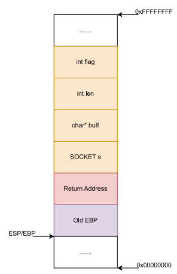

We can see the function arguments are highlighted in orange, the return address in red and the base pointer which is used to access the function arguments and local variables is highlighted in purple.

We need to setup the stack for function calls, in x86 architectures as all the function arguments are located on the stack, this is not too difficult as the buffer overflow often directly writes to the stack; in the case of a ROP attack we may find writing to registers and saving those onto the stack with a *gadget* an easier method too. If we were on a different architecture such as x86-64 where registers store some of the function arguments this may make the ROP chains more complicated. When we enter into the function the *prolog* will save the old `EBP` (Base pointer) value on the stack for us, so we need to be concerned with after loading the arguments onto the stack is the return address that the function will return to on completion allowing us to chain calls together. If we are able to build the stack in such a way, we can chain together functions and more often *gadgets* by the return values we placed onto the stack.


**Understanding returns**
Function returns are slightly more complicated than they may first appear, they do use the `RETN` instruction to revert the control flow back to the caller, or in our case change the control flow to an address we specify, before this the function resets the stack pointer to clear the local variables, and will reset the base pointer so the caller function is able to access it's arguments and local variables. The *callee* does not remove the arguments placed on the stack, we would need to locate a *gadget* to clean up these arguments and be the links between each ring in the chain we are creating.``

Below is the function epilog, in addition to a before and after image of a stack for the `recv(SOCKET s, char* buff, int len, int flags)` function. 
```s
mov	esp, ebp    ; Reset the stack pointer to be located above the local variables, pointing to the old base pointer
pop	ebp         ; load the old base pointer address so the caller can access its arguments and local variables
retn            ; Jump to the return address that has been placed on the stack (ESP)

; This may be shortened with the x86 instruction 'leave' which has the same effect
leave           ; Adjust the ESP register to point to EBP, and load the old EBP address on the stack into the EBP register 
retn            ; Jump to the return address that has been placed on the stack (ESP)
```

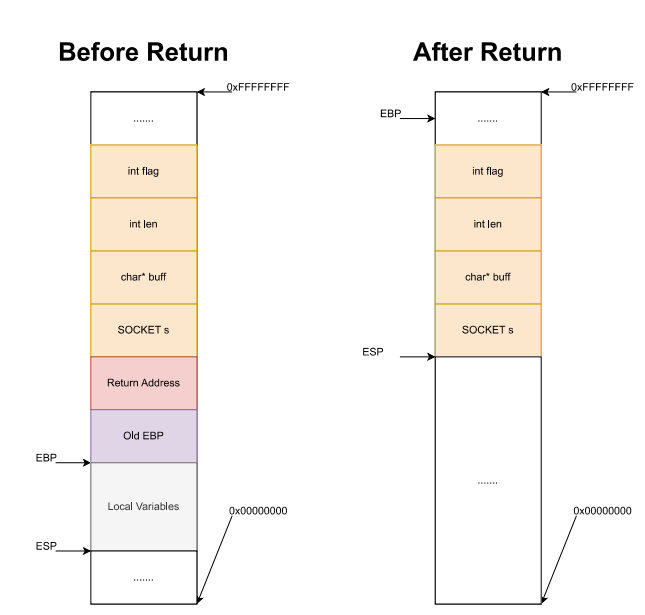

* *Note*: The values on the stack from the previous call are still there after the `RET` instruction, however we can consider them for the most part removed as future operations on the stack will overwrite them. If the program were to exit or preform any additional operations on the stack it is possible those values could remain for some time.  

We could create a chain such as the following to preform the recv call, and then return control flow back to the stack. This is idealized for simplicity, generally these chains are more complex and rather than directly calling a function after loading arguments onto the stack and then using a series of pop instructions to clear them, more often than not we will build the arguments and future addresses further down the stack by loading them into registers and pushing them onto the stack, later using those created values to call the target function.  


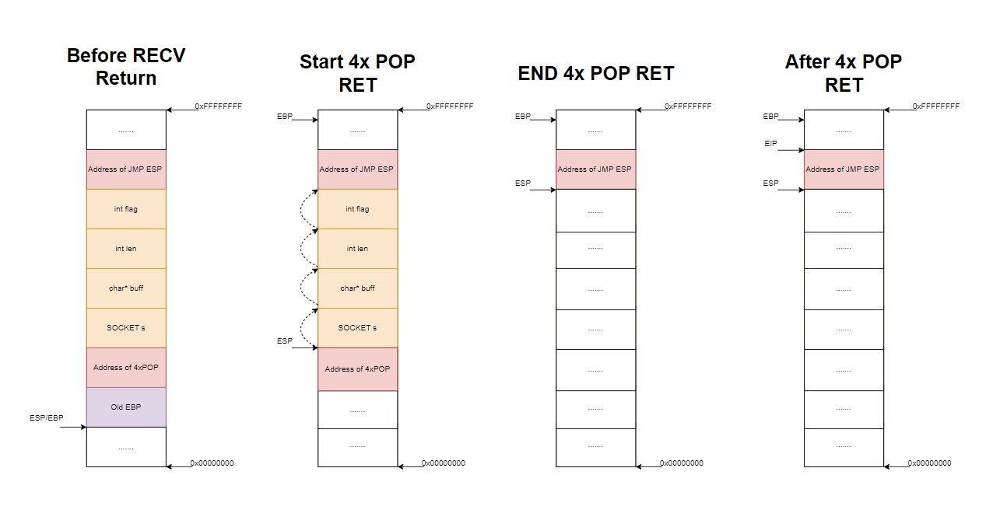 

The above image shows an idealized ROP chain, where we setup the stack such that we call the `recv` function first with a return address to a ROP gadget with the following signature:
```
pop eax
pop eax
pop eax
pop eax
retn
```
> *Note:* This is made up for simplicity, it is unlikely this kind of gadget would exist in a system, something more realistic could be ```add esp,0x0x10``` followed by a `retn`, however in either case this is an *idealized* ROP chain to give an idea of how they work!

This allows us to return control flow to shell code injected after our ROP Gadget (At the higher addresses), as we would likely place the address of a `JMP ESP` gadget such that once the pop gadget finishes it will return onto the stack through the `JMP ESP` instruction  oftentimes we will use a tool that allows us to construct a ROP chain  
#### ROP By Hand
Now we will generate a ROP chain by hand, hopefully this will provide greater clarity as to how ROP chains work, and how we can construct them. First we will need to have a goal, in this case we should load a specific value into a register. If we are able to do this we can eventually do a full exploit (Often with the help of some tools!). We will attempt to write the value `0xabcdabba` into a register, as it is commonly used the `EAX` register is a good choice, as convention is that the return value of a function is stored in the `EAX` register so gadgets like the command `POP EAX`followed by a `RETN` are not impossible to find.

1. We first need to plan out the shell code we want to execute in order to preform this operation, below is a simple set of shellcode we could have used in previous exploits.
	```
	xor eax, eax           ; Clear out the EAX register, we do not know what may be stored there 
	add eax, 0xabcdabb9    ; Add set eax = 0 + 0xabcdabb9 (One off from the goal so we can make the chain more interesting)
	inc eax                ; Get final value of eax
	```
2. We now need to find the address of a `RETN` instruction we will inject into our stack to overwrite the original return address, this is so we can start the ROP chain. To test this we can make our exploit file reflect [exploit0.py](./SourceCode/exploit0.py) which will inject the shellcode as we have done in past exploits to observe the behavior of the `RETN` instruction.
	1. Open VChat and attach it to the Immunity Debugger as has been done in the past, run the following command in the interpreter at the bottom.
		```
		!mona find -type instr -s "retn" -p 20 -o
		```
		* `!mona`: Run mona.py commands
		* `find`: Locate something withing the binary which has been loaded into Immunity debugger
		* `-type`: Specify the type of the object string we are searching for
			* `asc`: Search for an asci string
			* `bin`: Search for a binary string
			* `ptr`: Search for a pointer (memory address)
			* `instr`: Search for a instruction
			* `file`: Search for a file
		* `-s "<String>"`: Specify the string we are searching for
		* `-p <number>`: Limit amount of output to the number we specify (May need to increase this to find instructions at an executable location)
		* `-o`: Omit OS Modules

		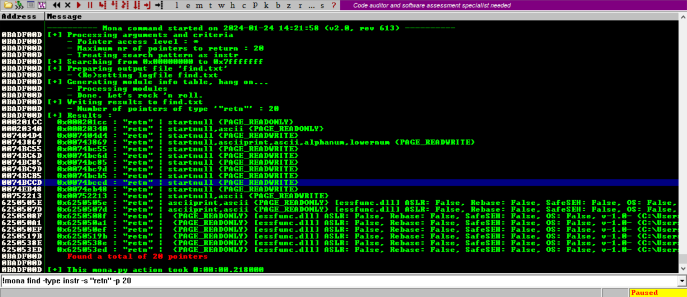 
		
		* We can see the output contains some valid choices, as *essfunc.dll* does not have ASLR enabled choosing one of those addresses allows us to maintain better portability. In this case I chose `0x6250508F` 

	2. Now we can generate the assembly we previously discussed in [shellcode0.asm](./SourceCode/shellcode0.asm) using the `/usr/share/metasploit-framework/tools/exploit/nasm_shell.rb` program on the *Kali Linux* System

		<video src="ASM-1.mp4" controls title="Title"></video>
	
	3. Next modify the address we overwrite in the exploit code to reflect [exploit0.py](./SourceCode/exploit0.py), with the basic instructions assembled from before and observe the results 
		
		<video src="E0.mp4" controls title="Title"></video>

		
		1. Click on the black button highlighted below, enter in the address we decided in the previous step

			

		2. Set a breakpoint at the desired address (Right click), in this case I chose `0x6250508F`

			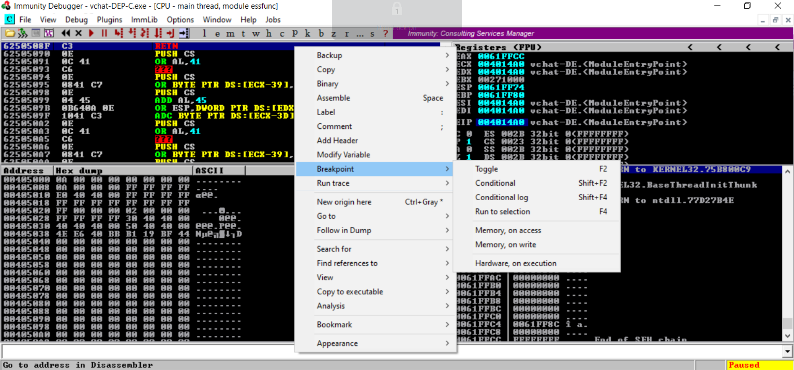

		3. Observe the EIP register it has the value `0xB905C031` this is a mix of our shell code `\x31\xc0` from the `XOR EAX,EAX` instruction and `\x05\xb9` is a part of the `ADD eax,0xabcdabb9` instruction. 

			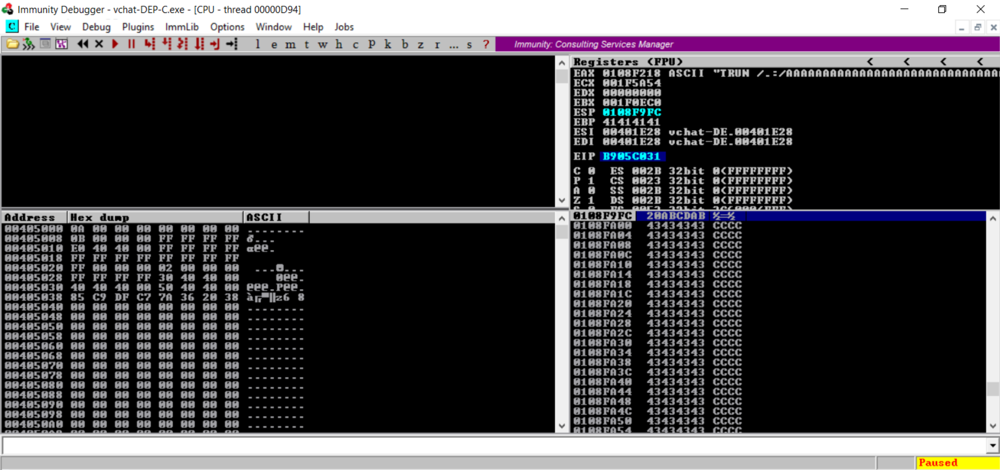

3. We can see if we write a *return address* 4-bytes after the address of the `RETN` instruction, we will once again gain control of the execution flow, so now we need to find an address for this location. Since we are unlikely to find a instruction like `ADD eax,0xabcdabba` we would be better off looking for an instruction that uses the stack to set the value of a register. Luckily we can look for a instruction like `POP EAX` followed by a `RETN`.

	<video src="essfUNC.mp4" controls title="Title"></video>

	1. Open VChat and attach it to the Immunity Debugger as has been done in the past, right click the CPU view and select *essfunc.dll*

		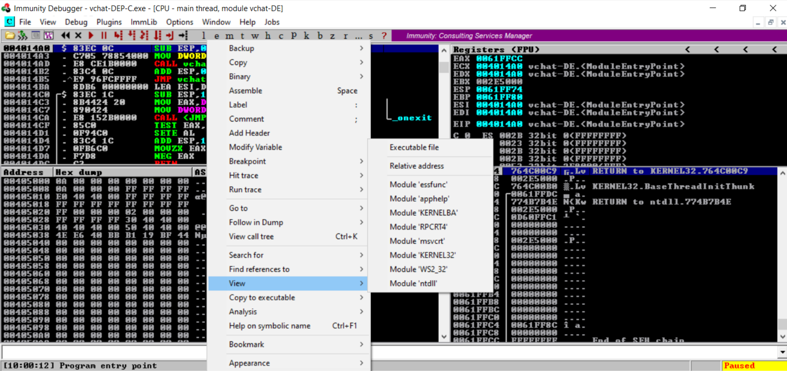

	2. Use the `CTL+S` keybind to open the command sequence search option and search for the `POP EAX` and `RETN` sequence.

		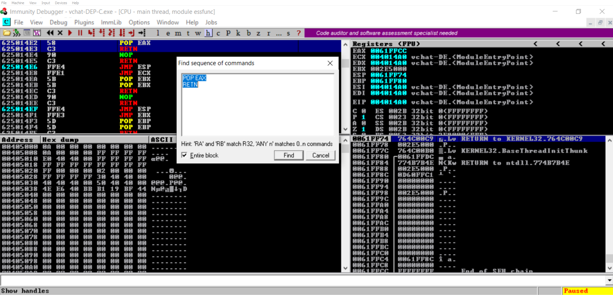

	3. Extract the address of the `POP EAX` instruction

4. Now we can modify our exploit code to reflect [exploit1.py](./SourceCode/exploit1.py), and verify that the code is executed. 

	<video src="POP-Gadget.mp4" controls title="Title"></video>

	1. Click on the black button highlighted below, enter in the address we decided in the previous step

		

	2. Set a breakpoint at the desired address (Right click), in this case I chose `0x6250508F`, the address of our `RETN` instruction

		

	3. Observe the flow of control, we should return to the `POP EAX`, and `RETN` sequence. Notice that the stack has the data we wanted to load `0xABCDABB9`, and once we step though the `POP EAX` instruction we will see it has been loaded into the `EAX` register.

		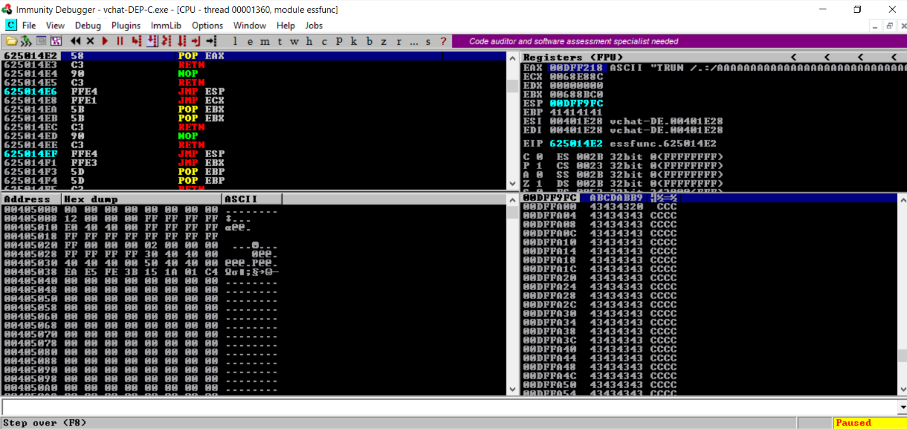	

5. Now we can search for a `INC EAX` instruction, after this we do not care what happens as we will have achieved the desired value `0xABCDABB9`. If we were concerned with what occurred after this, we would have simply put the `0xABCDABBA` value onto the stack and used the `RETN` value to jump to another gadget. 

	<video src="essfUNC2.mp4" controls title="Title"></video>

	1. Open VChat and attach it to the Immunity Debugger as has been done in the past, right click the CPU view and select *essfunc.dll*

		

	2. Use the `CTL+S` keybind to open the command sequence search option and search for the `POP EAX` and `RETN` sequence.

		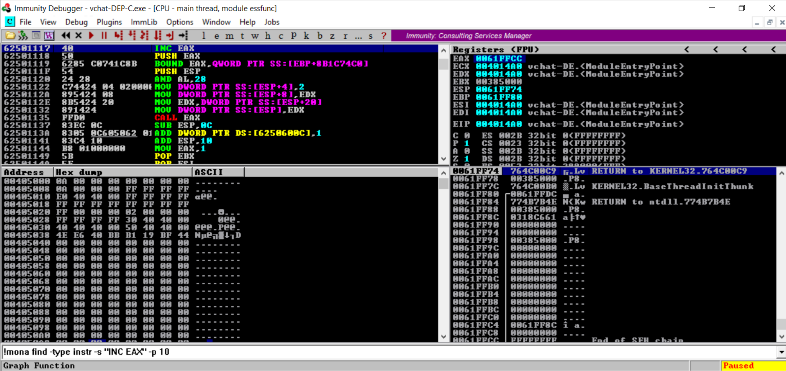

	3. Alternatively you could use the following command
		```
		!mona find -type instr -s "INC EAX" -p 10
		```
		* `!mona`: Run mona.py commands
		* `find`: Locate something withing the binary which has been loaded into Immunity debugger
		* `-type`: Specify the type of the object string we are searching for
			* `asc`: Search for an asci string
			* `bin`: Search for a binary string
			* `ptr`: Search for a pointer (memory address)
			* `instr`: Search for a instruction
			* `file`: Search for a file
		* `-s "<String>"`: Specify the string we are searching for
		* `-p <number>`: Limit amount of output to the number we specify
6. Now we can add this address to our exploit as shown in [exploit2.py](./SourceCode/exploit2.py)

	<video src="INC-Gadget.mp4" controls title="Title"></video>

	1. Click on the black button highlighted below, enter in the address we decided in the previous step

		

	2. Set a breakpoint at the desired address (Right click), in this case I chose `0x6250508F`, the address of our `RETN` instruction

		

	3. Observe the flow of control, we should first return to the `POP EAX`, and `RETN` sequence. And then due to the address we have place onto the stack we should jump to the `INC EAX` instruction. 

		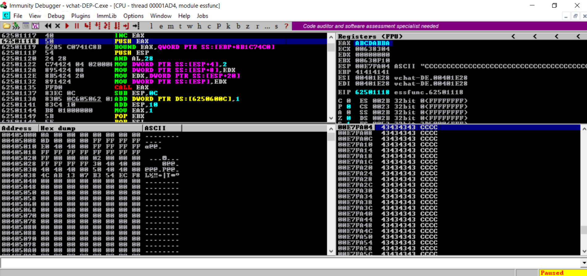

## essfunc.dll Code 
This section will discuss the [essfunc.dll](https://github.com/xinwenfu/vchat/blob/main/Server/essfunc.c) source code. This will not discuss the VChat code that handles the *TRUN* command as that has been discussed [before](https://github.com/DaintyJet/VChat_TRUN/tree/main/).

The *essfunc.dll* code is contained in the [essfunc.c](https://github.com/xinwenfu/vchat/blob/main/Server/essfunc.c) code file. This library does not contain much in terms of functional code. There are a number of *EssentialFuncX* functions which contain assembly or code vulnerable to buffer overflows. This code is included to make the task of generating ROP Gadgets, and finding useful instructions such as `JMP ESP` easier!

Below is a snippet of code from the essfunc.c file:
```c
void EssentialFunc2() {
	__asm__("jmp *%esp\n\t"
		"jmp *%eax\n\t"
		"pop %eax\n\t"
		"pop %eax\n\t"
		"ret");
}
```
This code uses the [GNU C Inline-Assembly](https://gcc.gnu.org/onlinedocs/gcc/Extended-Asm.html), using this in non-breaking ways is a fairly complicated endeavor, but in this case the use and existence of these functions is to provide assembly instructions that may be used in our normal exploits, and some that may provide useful gadgets when crafting ROP chains. Otherwise they are not directly used in the VChat server from a basic overview. 


## Test code
1. [exploit0.py](./SourceCode/exploit0.py): This code preforms an overflow jumping to a `RETN` instruction.
2. [exploit1.py](./SourceCode/exploit1.py): This code adds a gadget containing a `POP EAX` and `RETN` instruction to the chain.
3. [exploit2.py](./SourceCode/exploit2.py): This code adds an instruction `INC EAX` to the chain.

## References  
[1] https://www.corelan.be/index.php/2011/07/14/mona-py-the-manual/

[2] https://www.usenix.org/legacy/publications/library/proceedings/sec98/full_papers/cowan/cowan.pdf
